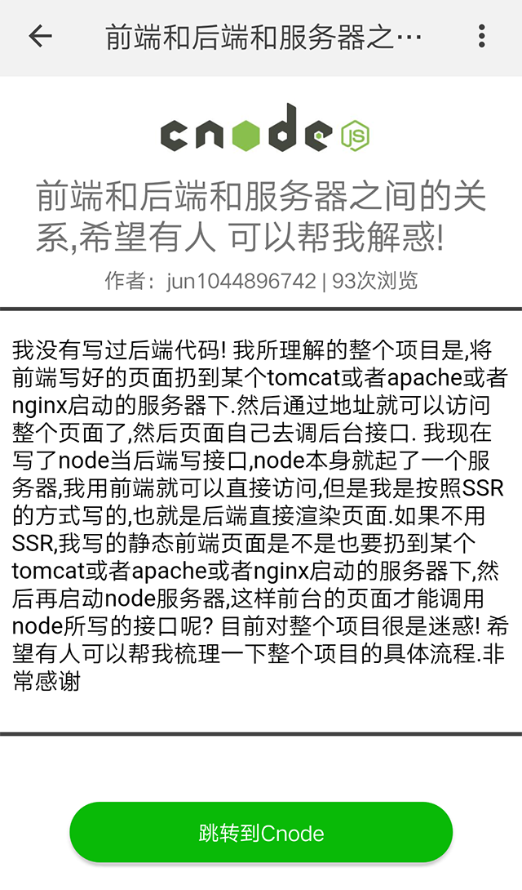

# 快应用 cnode

折腾了小半天
只是展示了主页的部分信息（标题和头像）
详情页只展示了标题，正文内容是html 快程序不知 如何展示，发愁中,没研究 懒（逃..）

## 2018年3月27日更新

1、首页添加文章分类

2、详情页添加richtext支持html显示

3、由于快应用的image标签只支持png, jpg和gif，所以有些连接图片无法显示

### 首页

### 详情页
